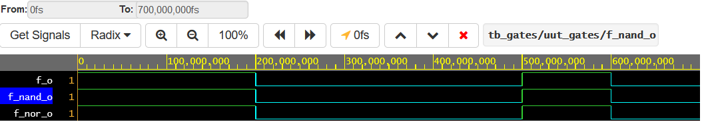
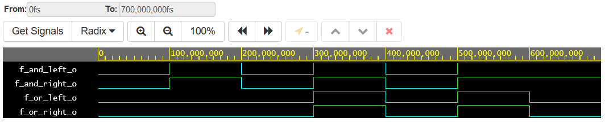

# Lab 01-gates
## Verification of De Morgan's laws

### Results table
| **c** | **b** |**a** | **f(c,b,a)** 
| :-: | :-: | :-: | :-:  
| 0 | 0 | 0 | 1 
| 0 | 0 | 1 | 1 
| 0 | 1 | 0 | 1 
| 0 | 1 | 1 | 0 
| 1 | 0 | 0 | 0 
| 1 | 0 | 1 | 0 
| 1 | 1 | 0 | 1 
| 1 | 1 | 1 | 0 

### [Link to EDA Playground project](https://www.edaplayground.com/x/QVNQ)

### Source VHDL code from ___design.vhd___
```VHDL
library ieee;                -- Standard library
use ieee.std_logic_1164.all; -- Package for data types and logic operations

------------------------------------------------------------------------
-- Entity declaration for basic gates
------------------------------------------------------------------------
entity gates is
    port(
        a_i    		: in  std_logic;         -- Data input
        b_i    		: in  std_logic;         -- Data input
        c_i    		: in  std_logic;         -- Data input
        f_o  		: out std_logic;         -- base output function
        f_nand_o 	: out std_logic;         -- NAND output function
        f_nor_o 	: out std_logic          -- NOR output function
    );
end entity gates;

------------------------------------------------------------------------
-- Architecture body for basic gates
------------------------------------------------------------------------
architecture dataflow of gates is
begin		   
    f_o 	<= (not b_i and a_i) or (not c_i and not b_i);
    f_nand_o 	<= not (not (not b_i and a_i) and not(not b_i and not c_i)); 
    f_nor_o 	<= not (b_i or not a_i) or not (c_i or b_i);
    
end architecture dataflow;
```

### Simulation screenshot


---
## Verification of Distributive laws

### [Link to EDA Playground project](https://www.edaplayground.com/x/9yRR)

### Source VHDL code from ___design.vhd___
```VHDL
library ieee;                -- Standard library
use ieee.std_logic_1164.all; -- Package for data types and logic operations

------------------------------------------------------------------------
-- Entity declaration for basic gates
------------------------------------------------------------------------
entity gates is
    port(
        a_i    			: in  std_logic;         -- Data input
        b_i    			: in  std_logic;         -- Data input
        c_i    			: in  std_logic;         -- Data input
        f_or_left_o 		: out std_logic;         -- OR LEFT SIDE output function
        f_or_right_o 		: out std_logic;         -- OR LEFT SIDE output function
        f_and_left_o		: out std_logic;         -- AND LEFT SIDE output function
        f_and_right_o		: out std_logic          -- AND RIGHT SIDE output function
    );
end entity gates;

------------------------------------------------------------------------
-- Architecture body for basic gates
------------------------------------------------------------------------
architecture dataflow of gates is
begin
    f_or_left_o		<= (a_i and b_i) or (a_i and c_i);
    f_or_right_o 	<= a_i and (b_i or c_i);
    f_and_left_o	<= (a_i or b_i) and (a_i or c_i);
    f_and_right_o	<= a_i or (b_i and c_i);

end architecture dataflow;

```

### Simulation screenshot

