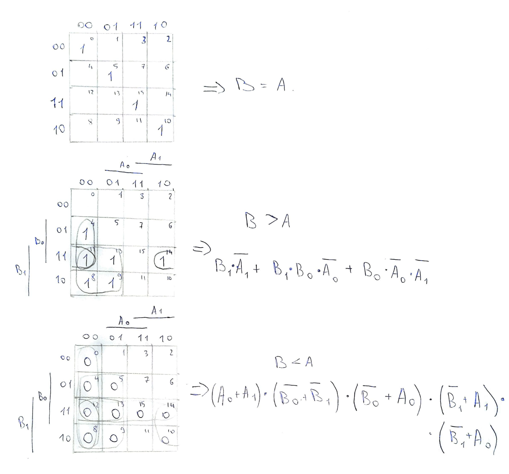
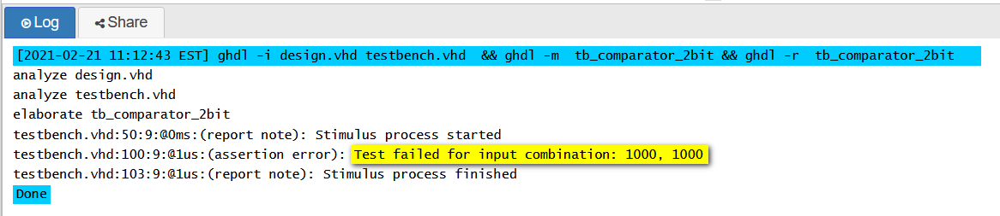

# Lab 02-logic
## 1. Preparation task
### 2-bit comparator truth table:
| **Dec. equivalent** | **B[1:0]** | **A[1:0]** | **B is greater than A** | **B equals A** | **B is less than A** |
| :-----------------: | :--------: | :--------: | :---------------------: | :------------: | :------------------: |
|          0          |    0 0     |    0 0     |            0            |       1        |          0           |
|          1          |    0 0     |    0 1     |            0            |       0        |          1           |
|          2          |    0 0     |    1 0     |            0            |       0        |          1           |
|          3          |    0 0     |    1 1     |            0            |       0        |          1           |
|          4          |    0 1     |    0 0     |            1            |       0        |          0           |
|          5          |    0 1     |    0 1     |            0            |       1        |          0           |
|          6          |    0 1     |    1 0     |            0            |       0        |          1           |
|          7          |    0 1     |    1 1     |            0            |       0        |          1           |
|          8          |    1 0     |    0 0     |            1            |       0        |          0           |
|          9          |    1 0     |    0 1     |            1            |       0        |          0           |
|         10          |    1 0     |    1 0     |            0            |       1        |          0           |
|         11          |    1 0     |    1 1     |            0            |       0        |          1           |
|         12          |    1 1     |    0 0     |            1            |       0        |          0           |
|         13          |    1 1     |    0 1     |            1            |       0        |          0           |
|         14          |    1 1     |    1 0     |            1            |       0        |          0           |
|         15          |    1 1     |    1 1     |            0            |       1        |          0           |
## 2. A 2-bit comparator
### Karnaugh maps and simplified SoP/PoS functions

### Link to my public EDA Playground example
https://www.edaplayground.com/x/wJ7U
## 3. A 4-bit binary comparator
### VHDL architecture  (```design.vhd```)
```vhdl
------------------------------------------------------------------------
-- Architecture body for 2-bit binary comparator
------------------------------------------------------------------------
architecture Behavioral of comparator_2bit is
begin
    B_greater_A_o <= '1' when (b_i > a_i) else '0';
    B_equals_A_o  <= '1' when (b_i = a_i) else '0';
    B_less_A_o    <= '1' when (b_i < a_i) else '0';

end architecture Behavioral;
```
### VHDL stimulus process (```testbench.vhd```)
```vhdl
    --------------------------------------------------------------------
    -- Data generation process
    --------------------------------------------------------------------
    p_stimulus : process
    begin
        report "Stimulus process started" severity note;


        -- test 1
        s_b <= "0000"; s_a <= "0000"; wait for 100 ns;
        assert ((s_B_greater_A = '0') and (s_B_equals_A = '1') and (s_B_less_A = '0'))
        report "Test failed for input combination: 0000, 0000" severity error;
        
        -- test 2
        s_b <= "0000"; s_a <= "0001"; wait for 100 ns;
        assert ((s_B_greater_A = '0') and (s_B_equals_A = '0') and (s_B_less_A = '1'))
        report "Test failed for input combination: 0000, 0001" severity error;
        
        -- test 3
        s_b <= "0000"; s_a <= "0010"; wait for 100 ns;
        assert ((s_B_greater_A = '0') and (s_B_equals_A = '0') and (s_B_less_A = '1'))
        report "Test failed for input combination: 0000, 0010" severity error;
        
        -- test 4
        s_b <= "0000"; s_a <= "0011"; wait for 100 ns;
        assert ((s_B_greater_A = '0') and (s_B_equals_A = '0') and (s_B_less_A = '1'))
        report "Test failed for input combination: 0000, 0011" severity error;
        
        -- test 5
        s_b <= "0000"; s_a <= "0100"; wait for 100 ns;
        assert ((s_B_greater_A = '0') and (s_B_equals_A = '0') and (s_B_less_A = '1'))
        report "Test failed for input combination: 0000, 0100" severity error;
        
        -- test 6
        s_b <= "0001"; s_a <= "0000"; wait for 100 ns;
        assert ((s_B_greater_A = '1') and (s_B_equals_A = '0') and (s_B_less_A = '0'))
        report "Test failed for input combination: 0001, 0000" severity error;
        
        -- test 7
        s_b <= "0010"; s_a <= "0000"; wait for 100 ns;
        assert ((s_B_greater_A = '1') and (s_B_equals_A = '0') and (s_B_less_A = '0'))
        report "Test failed for input combination: 0010, 0000" severity error;
        
        -- test 8
        s_b <= "0011"; s_a <= "0000"; wait for 100 ns;
        assert ((s_B_greater_A = '1') and (s_B_equals_A = '0') and (s_B_less_A = '0'))
        report "Test failed for input combination: 0011, 0000" severity error;
        
        -- test 9
        s_b <= "0100"; s_a <= "0000"; wait for 100 ns;
        assert ((s_B_greater_A = '1') and (s_B_equals_A = '0') and (s_B_less_A = '0'))
        report "Test failed for input combination: 0100, 0000" severity error;
        
        -- test 10 with error
        s_b <= "1000"; s_a <= "1000"; wait for 100 ns;
        assert ((s_B_greater_A = '0') and (s_B_equals_A = '0') and (s_B_less_A = '1'))
        report "Test failed for input combination: 1000, 1000" severity error;
        
        report "Stimulus process finished" severity note;
        wait;
    end process p_stimulus;

```
### Console output, i.e. with one reported error

### Link to my public EDA Playground example
https://www.edaplayground.com/x/7vDi

